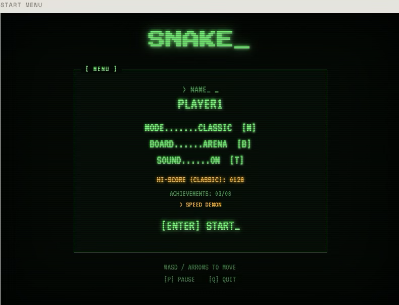
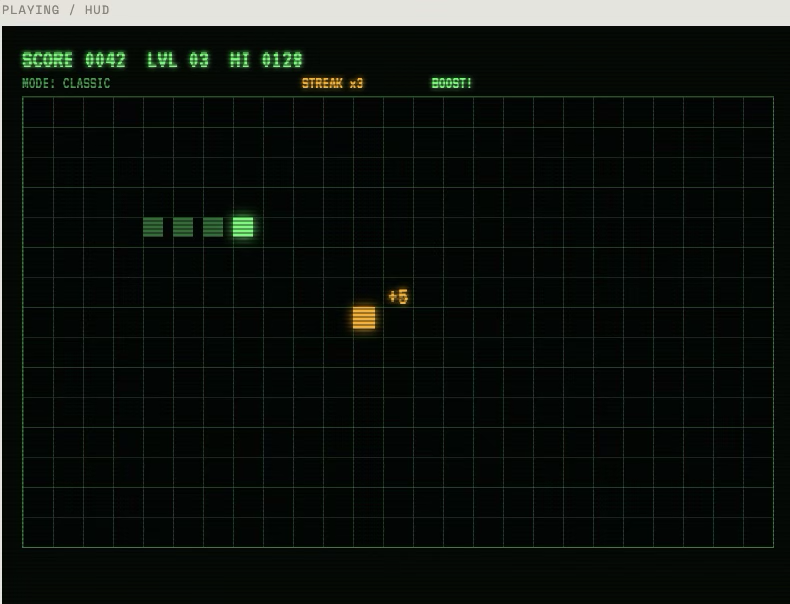

# Snake

A windowed Snake game built with Rust and [macroquad](https://github.com/not-fl3/macroquad). The UI uses a **CRT Phosphor Terminal** look — dark green/amber palette, glow text, scanlines, and terminal-style menus.

## Screenshots

| Start menu | Gameplay / HUD |
|------------|----------------|
|  |  |

## Features

- **Classic**, **Wrap**, and **Daily Challenge** game modes
- **Board presets**: Classic (20×10), Compact (15×8), Arena (25×15)
- **Special food**: Normal (+1), Golden (+5), Speed Boost (+2 with temporary faster ticks)
- **Combo streaks**: eat quickly for bonus points and streak multipliers
- Progressive speed increase every 5 food eaten (Classic/Wrap)
- Input buffer (1–2 turns queued) for fair high-speed play
- Win condition when the board is completely filled
- Smooth interpolated snake movement
- Sound effects for eating, level-up, and game over
- Per-mode top-5 leaderboards (persisted in `~/.snake_cli_leaderboard`)
- 8 achievements (persisted in `~/.snake_cli_achievements`)
- Run statistics on game over (food eaten, max streak, time, vs. personal best)
- Start menu, countdown, pause, level-up overlay, and victory/game-over screens

## Requirements

- [Rust](https://www.rust-lang.org/tools/install) (stable)

## Build and run

```bash
cargo run
```

Release build:

```bash
cargo build --release
./target/release/snake_cli
```

## Controls

| Key | Action |
|-----|--------|
| WASD / Arrow keys | Move |
| Tab | Edit / finish editing name |
| M | Toggle Classic / Wrap / Daily mode (start menu) |
| B | Toggle board preset (start menu) |
| Enter | Start / Play again |
| P | Pause / Resume |
| T | Toggle sound |
| R | Play again (game over) |
| Q / Esc | Quit |

## Game modes

- **Classic** — hitting a wall ends the game
- **Wrap** — the snake wraps around to the opposite side
- **Daily** — fixed tick rate, same food sequence for everyone each day (seeded RNG)

## Development

```bash
cargo test
cargo fmt --all
cargo clippy --all-targets -- -D warnings
```

CI runs on every push to `main` via GitHub Actions.

## Version

Current version: **0.2.0**
